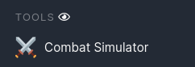
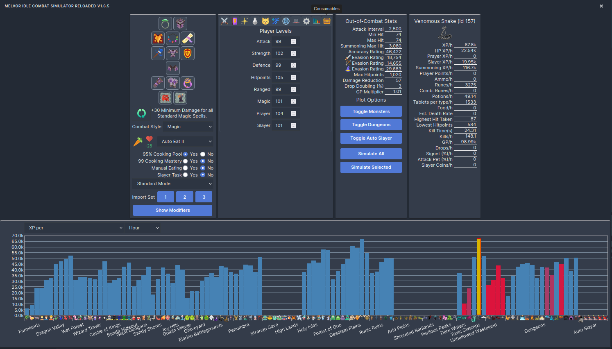
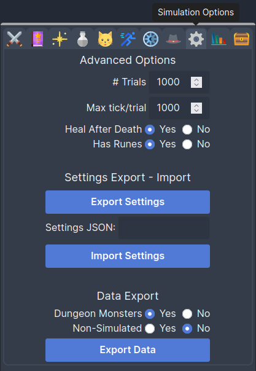

# Melvor Idle Combat Simulator Reloaded

A browser extension for the game [Melvor Idle](http://www.melvoridle.com/).

A fork of the great but no longer maintained [Melvor Idle Combat Simulator](https://github.com/coolrox95/Melvor-Idle-Combat-Simulator) by Coolrox95.

## Before you start
- Create a backup of your save file before using this extension, in particular after a recent game or extension update.
- After installing the extension, a refresh of the game may be required.
- Do not activate multiple instances of the extension at once.

## Bug reports
Raise an [issue](/../../issues) here on GitHub, or visit the #scripting-and-extensions channel on the [official Melvor Idle Discord](https://discord.gg/melvoridle).  
When reporting bugs please include:
- any required reproduction steps (e.g. a settings export, the monster you simulated, etc.)
- any console errors

## Installation
### Firefox:
Get the add-on [on AMO](https://addons.mozilla.org/en-US/firefox/addon/combat-simulator-reloaded/).

### Chromium-based browsers:
**(Chromium, Google Chrome, Microsoft Edge, Brave, Opera, Kiwi Browser, etc.)**  
Get the extension [on the Chrome Web Store](https://chrome.google.com/webstore/detail/melvor-idle-combat-simula/cgggfndkphggbgeimpplooflemnfndok).  
For some of the chromium-based browsers (e.g. Microsoft Edge) you have to specifically allow "extensions from other stores".

### Install a pre-release, or install any version from source
1. Download the version of your choice (clone the repo; [latest master source](/../../archive/refs/heads/master.zip); [latest version](/../../releases/latest); etc.)
2. If zipped, extract the files.
3. Install the extension: [chromium instructions](https://developer.chrome.com/docs/extensions/mv3/getstarted/#unpacked), [firefox instructions](https://www.youtube.com/watch?v=J7el77F1ckg)  
   Depending on your browser you will have to point to the manifest file directly or to the Extension directory containing it.

### Mobile
The Melvor Idle mobile app does not support extensions. However, some mobile browsers allow extensions from the chrome web store (e.g. Kiwi Browser on Android), in these browser you can then use the simulator.

## Quick Guide
The combat simulator allows you to configure a combat setup and simulate monsters, dungeons, and auto-slayer.

You can find the simulator by clicking the Combat Simulator button in the Tools section in the game's sidebar, between Non-Combat and Minigame.

The view has 5 main parts:

1. equipment, common toggles, and import buttons
2. configuration card with 11 different tabs, such as levels, agility course, spells, etc.
3. out-of-combat stats overview, and simulation buttons
4. data card for the currently selected monster or dungeon
5. histogram for the selected metric

### Instructions
1. Open the simulator through the game's sidebar.
2. Import your setup (gear, levels, spell selection, agility course, etc.), each button corresponds to an equipment set.
3. Make any desired changes to your setup.
4. In the chart select a monster or dungeon by clicking above its icon.
5. Use the "Simulate Selected" button to simulate the selected entity.
6. Alternatively, use the "Simulate All" button to simulate all entities that are not disabled.

## In-depth guide [WIP]
### 1 Equipment, common toggles, and import buttons

  
1.1 Equipment

 - To change equipment click on the slot you want to change and select the desired equipment from the popup menu.

  
1.2 Toggles

 - Enable or disable summoning synergy by clicking the synergy icon.
 - Use the Combat Style dropdown menu to change the style for the selected weapon.
 - To change food click on the food icon and select the desired food from the popup menu.
 - Select the Auto Eat tier from the dropdown.
 - If "95% Cooking Pool" is enabled, the cooking pool bonus is applied to all food healing.
 - If "99 Cooking Mastery" is enabled, the cooking mastery bonus is applied to all *cooked* food healing.
 - If "Manual Eating" is enabled, the simulator will manually eat when player HP is dangerously low (consuming food and resetting attack timers).
 - If "Slayer Task" is enabled, any on-task bonuses are applied to the simulations, and dungeons can not be simulated. If "Slayer Task" is disabled, auto slayer tiers can not be simulated.
 - Select the Game Mode in the dropdown.

  
1.3 Import

 - Click on the numbered buttons to import the corresponding equipment set from the game.
 - Player levels, spells, prayers, potions, pets, etc. will also be imported.

  
1.4 Show Modifiers

 - Shows an overview of all the net modifiers that are configured in the simulator. This includes modifiers from gear, agility obstacles, astrology stars, etc.
 - Note that some bonuses are not modifiers.

### 2 Configuration card

  
2.1 Levels

 - Levels may be set to 'virtual' values above 99, these will not provide benefits to your stats but they will factor into the calculation of pet chances.

  
2.2 Spells

 - Select a spell, a curse, an aurora, or an ancient magick spell for which you meet the level and gear requirements.
 - Spells are disabled when requirements are no longer met.
 - If no normal or ancient spell is selected with a magic weapon equipped, air strike is selected.

  
2.3 Prayer

 - Select up to 2 prayers that you meet the level requirements for.
 - Prayers are disabled when level requirement is no longer met.

  
2.4 Potions

 - Use the Potion Tier dropdown to change the tier
 - Click on the potion icons to select the type

  
2.5 Pets

 - Enable or disable pets that affect combat.

  
2.6 Agility Course [WIP]

  
2.7 Star Modifiers [WIP]

  
2.8 Loot [WIP]

  
2.9 Simulation Settings

 - The simulation of a monster will end if the maximum number of ticks (default 1k \* 1k = 1M) is exceeded, or when the desired number of trials have been simulated.
   - **"\# Trials"** is the number of fights that are simulated for each monster. Default is 1000.
   - **"Max tick/trial"** is the maximum number of ticks per trial. The ticks are pooled over all trials for a monster. Default is 1000, this corresponds with 20s fights.
 - If **"Heal After Death"** is enabled, food will be consumed after a player death to bring the player back to full health. If it is disabled, the next fight will begin with the default health (20%). Enabled by default.
 - If **"Has Runes"** is disabled, the simulator will assume that the player has no runes, and no spells will be cast. Enabled by default.
 - **Settings Export** creates a JSON string with the current setup in the sim and copies it to your clipboard. If the clipboard is not available, a modal containing the JSON is opened instead.
 - With **Settings Import** you can paste a settings export JSON string in the text box, and import it to the sim with the button.
 - **Data Export** creates a JSON string with the current simulation results, and copies it to your clipboard. If the clipboard is not available, a modal containing the JSON is opened instead.
   - If **Dungeon Monsters** is enabled, all monsters in a dungeon will be included in the data export JSON.
   - If **Non-Simulated** is enabled, entities that were not simulated will be included in the data export JSON.
 
 

  
2.10 Saved Simulations [WIP]

Allows you to save and load simulations. By default this is disabled.

  
2.11 Consumables [WIP]

### 3 Stat card and simulation buttons

  
3.1 Stat card

The stat card shows combat stats out of combat, i.e. before the combat triangle or (de)buffs are applied.

  
3.2 Inspect Dungeon

"Inspect Dungeon" allows you to view the simulation results for individual monsters inside the selected dungeon.

  
3.3 Simulation Target Toggles

"Toggle Monsters" (resp. "Dungeons", "Auto Slayer") enables or disables all monsters (resp. dungeons, auto slayer). Disabled entities will not be simulated.

  
3.4 Simulation Buttons

 - "Simulate All" runs the simulator for all enabled entities. Some simulations may still be skipped if the entry requirements are not met.
 - "Simulate Selected" runs the simulator only for the currently selected entity, i.e. it simulates one monster, one dungeon, or one auto slayer tier.
 - The button can be pressed again to cancel a simulation early. Simulations of monsters that were already sent to the web workers will still be completed.

 
### 4 Data card

  
4.1 XP [WIP]

  
4.2 Resource Consumption [WIP]

  
4.3 Estimated Death Rate [WIP]

  
4.4 Kill Rate [WIP]

  
4.5 Loot [WIP]

### 5 Histogram

The histogram shows the results of the simulation for all entities.

 - Select the desired metric from the dropdown. Default is combat XP.
 - Select the desired time unit from the dropdown. Default is 1 hour. This time unit is also used in the data card.
 - Toggle the simulation of individual monsters or dungeons by clicking on their image below the plot or toggle groups with the "Toggle \<Entity\>" buttons in the stat card.
 - Disabling an entry will also remove its bar from the plot and adjust the data display scaling based on the remaining bars.
 - Select a bar to view detailed information about that monster, dungeon, or auto slayer tier.
 - "Inspect Dungeon" in the stat card shows the simulation results for individual monsters inside a dungeon.
 - Colours are a gradient between blue (0% estimated death rate) to red (100% estimated death rate).
 - The highest scoring entity for the selected metric is highlighted in yellow (with a similar gradient based on death rate).

## Notes for Mozilla Reviewers
> This add-on is a simulation tool for a browser game (Melvor Idle). We run "eval" on some functions and classes in a web worker, these functions and classes are part of the page where the content script is injected, some of these are modified by the script before passing them to the web worker. Here, "eval" is used to recreate a modified version of the game environment in web workers. This functionality can not be replicated with "window.Function". The performance hit is minimal, since this environment only has to be created once at the start of the session.